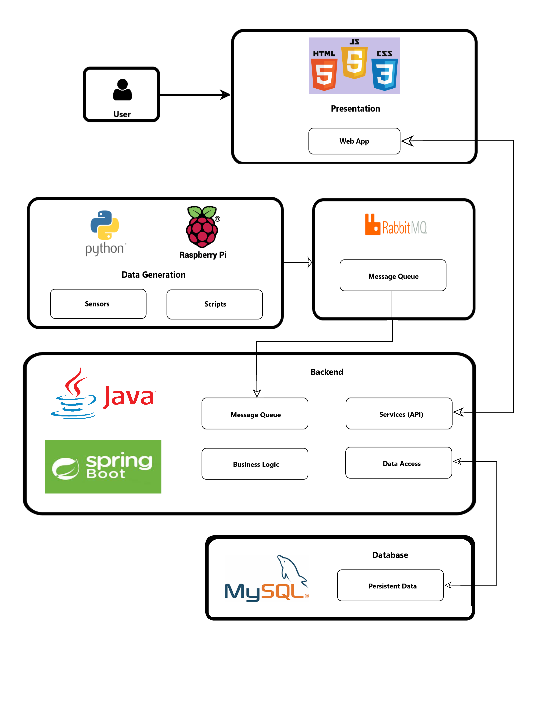
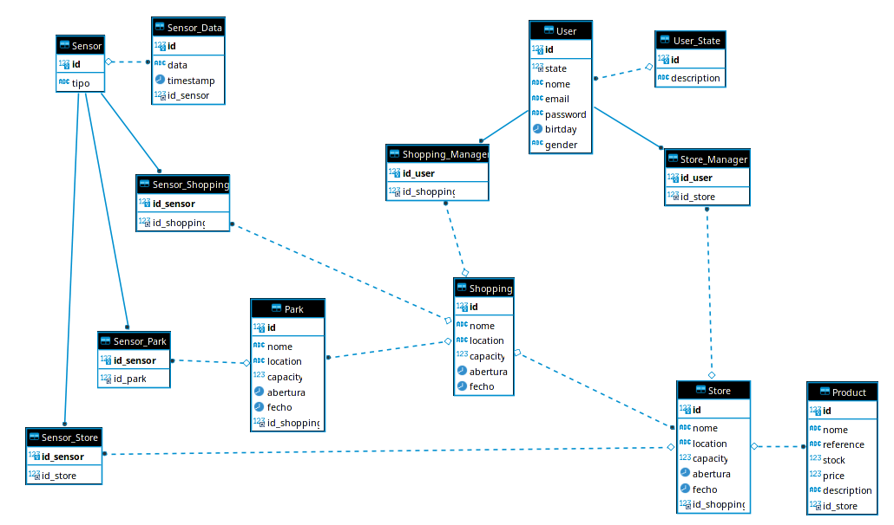

# ShopAholytics
A shopping habits analysis service.


## Services

### Deploy

#### Remote (192.168.160.238)

```$ ssh user@deti-engsoft-15 "cd ies_52; sudo ./run.sh```


#### Local (localhost)

```$ run.sh -a```

```run.sh``` is a script to help deploying the project easier. ```$ run.sh -h``` to see usage.

#### Ports

| Service | Port | Credentials |
| :---: | :---: | :---: |
| client | 8000 | *email*: admin@ua.pt<br /> *password*: admin |
| spring api | 6868 | |
| db | 3307 | *user*: user<br /> *password*: user |
| rabbitmq HTTP | 15672 | *user*: guest<br /> *password*: guest |
| rabbitmq AMQP | 5672 | | 

Ports can be configured in the ```.env``` file.

*Note*: if ```$SPRING_LOCAL_PORT``` is changed, the variable ```PORT``` on ```/FrontEnd/js/consts.js```  must be changed too (we will add it as an environmental variable soon).


## Abstract

ShopAholytics is a web app that studies everything related to client behaviour, providing useful info for managers and marketing teams. With our service, companies will be able to quickly analyze shopping tendencies during specific periods of time and tracks the shoppers' flow in realtime. Our main goal is to provide the necessary data to make smarter, more efective business choices.


## Authors

| Nome | Função | Email | Nmec |
| :---: | :---: | :---: | :---: |
| Alexandre Serras | Architect | alexandreserras@ua.pt | 97505 |
| Gonçalo Leal | Team Manager | goncalolealsilva@ua.pt | 98008 |
| João Farias | Product Owner | joaobernardo0@ua.pt | 98679 |
| Vasco Regal | DevOps Master | vascoregal24@ua.pt | 97636 |


## Architecture

### Diagram



### Frontend

Our frontend will be developed using HTML CSS and Javascript

### Data Capture

We will be using a simulated data stream. To achieve this, we use a **Raspberry** to run a set of scripts simulating visits and purchases.
In a real world situation, our sensors would be set up on a shop's entrances and exits.

### Backend

#### REST API

The service layer of our web-app is a **Spring** based REST API using **Java Persistence API** to manage manipulate our resources.

#### Message Broker

To make the bridge between the data generation and our database, we use **RabbitMQ**.

### Database

We store all our data on a **mySQL** database.

#### Data Model




